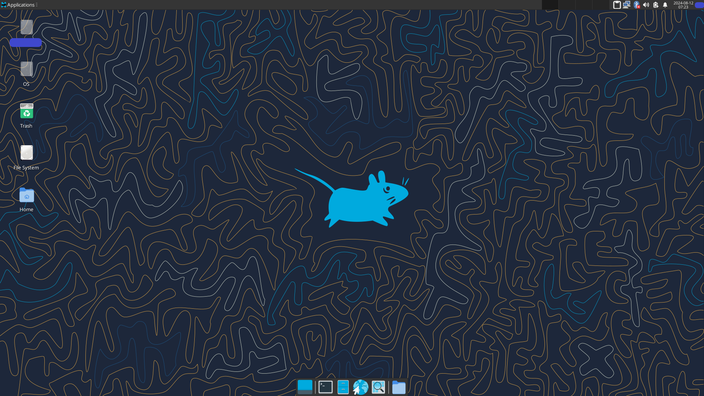

## Fedora Xfce4 Install Guide

The standard Fedora installation process for Xfce desktop includes additional packages that may not be necessary for many users. This guide will allow you to install a minimal Xfce desktop, adding additional packages as needed.

## Requirements

* A Fedora netinstall LIVE USB.

* sudo privileges to install packages and run optional install script.

## ISO for installing Fedora

* [Download Fedora Everything net installer](https://alt.fedoraproject.org/)

## Installing Fedora with Xfce4

In the Software Selection menu, select `Xfce Desktop` as the base environment & add the following additional softwares for the selected environment,
* `Applications for the Xfce Desktop`
* `Multimedia support for Xfce`

_Note: You can skip these too maybe, installs a lot of crap._

## Switching from LightDM to SDDM

LightDM was randomly causing Black Screen during some of my system startups. If it happens with you too, switch to SDDM.

Remove LightDM:

```console
sudo dnf remove lightdm
```

Install SDDM:

```console
sudo dnf install sddm
```

After this, if SDDM doesn't automatically start on restart, use the following command.
_(Note: I don't remember if I've used this command. So it might be wrong.)_

```console
sudo systemctl start sddm
```

## Installing proprietary NVIDIA graphics card driver

Prerequisites:
* This guide requires the secure boot to be turned off to load up the unsigned NVIDIA kernel modules.

### Step #1: Update from the existing repositories

```console
sudo dnf update
```

### Step #2: Add the RPM Fusion nonfree repositories
Install nonfree repositories & enable fedora-cisco-openh264 repository:

```console
sudo dnf install https://mirrors.rpmfusion.org/free/fedora/rpmfusion-free-release-$(rpm -E %fedora).noarch.rpm https://mirrors.rpmfusion.org/nonfree/fedora/rpmfusion-nonfree-release-$(rpm -E %fedora).noarch.rpm
sudo dnf config-manager --enable fedora-cisco-openh264
```

### Step #3: Refresh to add the new repositories

```console
sudo dnf update --refresh
```

### Step #4: Install the driver & its dependencies
Update the system:

```console
sudo dnf update -y
```

_Note: Reboot if not on the latest kernel._

Install the following packages:

```console
sudo dnf install gcc
sudo dnf install automake
sudo dnf install akmod-nvidia
sudo dnf install xorg-x11-drv-nvidia-cuda
sudo dnf install xorg-x11-drv-nvidia-libs.i686
```

### Step #5: Wait for the kernel modules to load up
You must wait 5-10 minutes for the kernel modules to load. Please do not proceed to the next steps immediately.
_(Note: I'm not sure if it is necessary to wait. I've never tried not waiting. Just saw it in the doc, so putting it here.)_

Once the module is built,

```console
modinfo -F version nvidia
```

should outputs the version of the driver such as `440.64` & not `modinfo: ERROR: Module nvidia not found.`

### Step #6: Using KMS, add NVIDIA modeset argument to kernel boot parameters

```console
sudo grubby --update-kernel=ALL --args='nvidia-drm.modeset=1'
```

_Note: DO NOT restart after this step. Gives me black screen._

### Step #7: Install the following packages
Install `Vulkan`:

```console
sudo dnf install vulkan
```

Install `NVENC/NVDEC`:

```console
sudo dnf install xorg-x11-drv-nvidia-cuda-libs
```

_Note: xorg-x11-drv-nvidia-cuda already covers this installation._

Install `VDPAU/VAAPI`:

```console
sudo dnf install nvidia-vaapi-driver libva-utils vdpauinfo
```

### Step #8: Edit the X11 configuration
Install `xrandr`:

```console
sudo dnf install xrandr
```

Edit the `nvidia.conf` from `/usr/share/X11/xorg.conf.d/` to add

```console
Option "PrimaryGPU" "yes"
```

in the `OutputClass` section of it.

For example, use `MousePad` with root privileges to edit the `nvidia.conf` file. Use the following command to launch `MousePad` as root.

```console
sudo MousePad
```

Then open `nvidia.conf` file in `MousePad` from `/usr/share/X11/xorg.conf.d/` & make the required changes.

The file should look similar to this.

```console
#This file is provided by xorg-x11-drv-nvidia
#Do not edit

Section "OutputClass"
    Identifier "nvidia"
    MatchDriver "nvidia-drm"
    Driver "nvidia"
    Option "AllowEmptyInitialConfiguration"
    Option "SLI" "Auto"
    Option "BaseMosaic" "on"
    Option "PrimaryGPU" "yes"
EndSection

Section "ServerLayout"
    Identifier "layout"
    Option "AllowNVIDIAGPUScreens"
EndSection
```

You can see the additions in both sections.

Execute the following command to copy the display render details for the X11:

```console
sudo cp -p /usr/share/X11/xorg.conf.d/nvidia.conf /etc/X11/xorg.conf.d/nvidia.conf
```

Edit the `Xsetup` file from `/etc/sddm/` to add:

```console
xrandr --setprovideroutputsource modesetting NVIDIA-0
xrandr --auto
```

Restart SDDM:

```console
systemctl restart sddm
```

### Step #11: Reboot your system
Reboot your system and proceed to the next steps to verify the change in configuration.

```console
sudo reboot
```

### Step #12: Verify the configuration
Execute:

```console
glxinfo | egrep "OpenGL vendor|OpenGL renderer"
```

It should show your NVIDIA GPU.

Execute:

```console
neofetch
```

It should show your NVIDIA GPU under the GPU name.

Execute:

```console
glxgears
```

It should display 3D OpenGL graphics by running `glxgears` program.

## Switching between Nouveau/NVIDIA
To boot using the Nouveau driver instead of the NVIDIA binary driver, edit the kernel entry from grub bootloader & remove the following linux boot command arguments,

```console
rd.driver.blacklist=nouveau modprobe.blacklist=nouveau nvidia-drm.modeset=1
```

then boot with the updated boot command.

## Reference docs:
* [NVIDIA](https://rpmfusion.org/Howto/NVIDIA)
* [Multimedia](https://rpmfusion.org/Howto/Multimedia)
* [Optimus](https://rpmfusion.org/Howto/Optimus)
* [How to Set Nvidia as Primary GPU on Optimus-based Laptops](https://docs.fedoraproject.org/en-US/quick-docs/set-nvidia-as-primary-gpu-on-optimus-based-laptops/)
* [Configuration](https://rpmfusion.org/Configuration)
* [Display Managers](https://wiki.archlinux.org/title/NVIDIA_Optimus#Display_managers)
* [Resolution, screen scan wrong. EDID errors in Xorg.log](https://wiki.archlinux.org/title/NVIDIA_Optimus#Resolution,_screen_scan_wrong._EDID_errors_in_Xorg.log)
* [Third-Party Repositories](https://docs.fedoraproject.org/en-US/workstation-working-group/third-party-repos/)
* [Fuse](https://src.fedoraproject.org/rpms/fuse)
